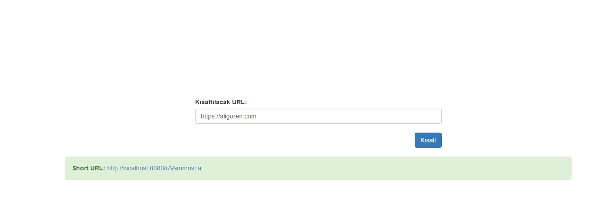
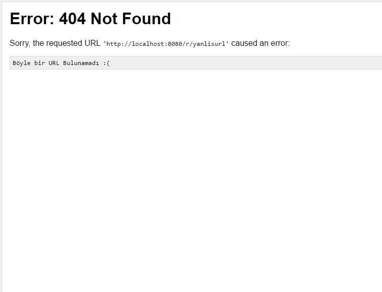

# PyShort

## Python Url Shortener with BottlePy Framework

Python ve Bottle Framework Kullanılarak Basit URL Shortener

Projede hashids ve bottle kullanıldı.

Front-end kısmında ise Bootstrap ve JQuery Kullanıldı. Örnek olması açısından.

# Gereksinimler

```
hashids
bottle
```

# Nasıl Çalışır?

Çalışma işlemi için komut satırına `python PyShortUrl.py` yazmanız yeterli olacaktır.
Çalışma anında girilen URL hatalı ise dahili 404 döndürür.

# Ekran Görüntüleri

### URL Oluşturma Ekranı



### Hatalı ID Girilince


